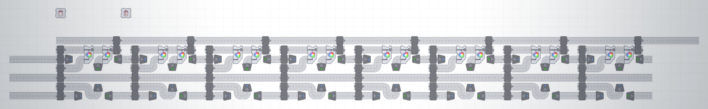
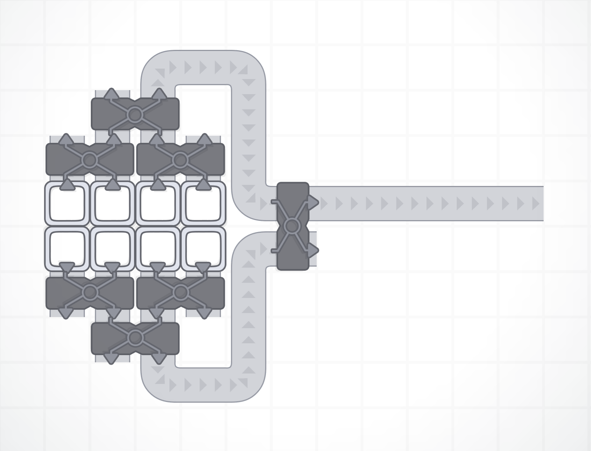

# shapez.io Blueprints

## Coloring

### T1

* Colormixer: Combines two colors to a new one:

* Whitemixer: Combines all three colors to white:

* Painter: Apply a color to shapes:

### T2

T2 starts if having the larger painter which halfs the amount of needed color.

* Colormixer: Combines two colors to a new one:

* Whitemixer: Combines all three colors to white:

* Painter: Apply a color to shapes:

### Quartly Painter

At the last level comes a new painter which maybe helps with the different colored shapes.

## Miner

### T1

### T2

T2 starts if having the chain extractor.

## Combiner

